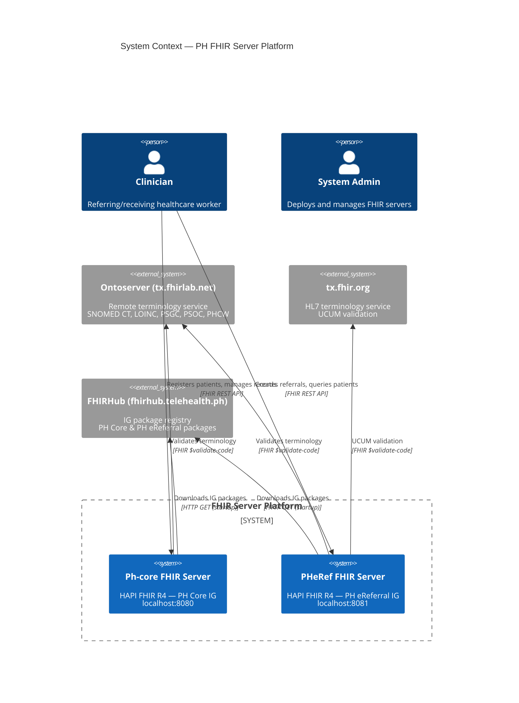
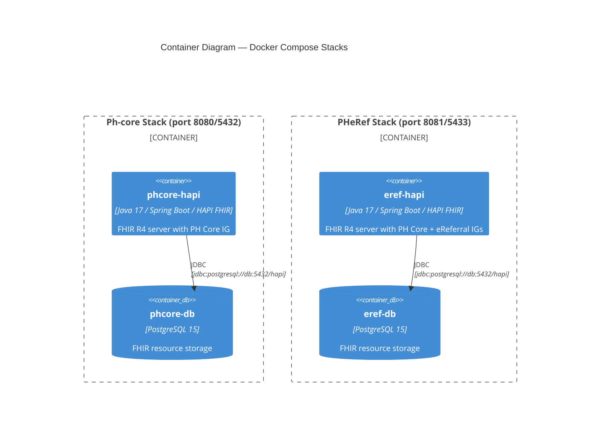
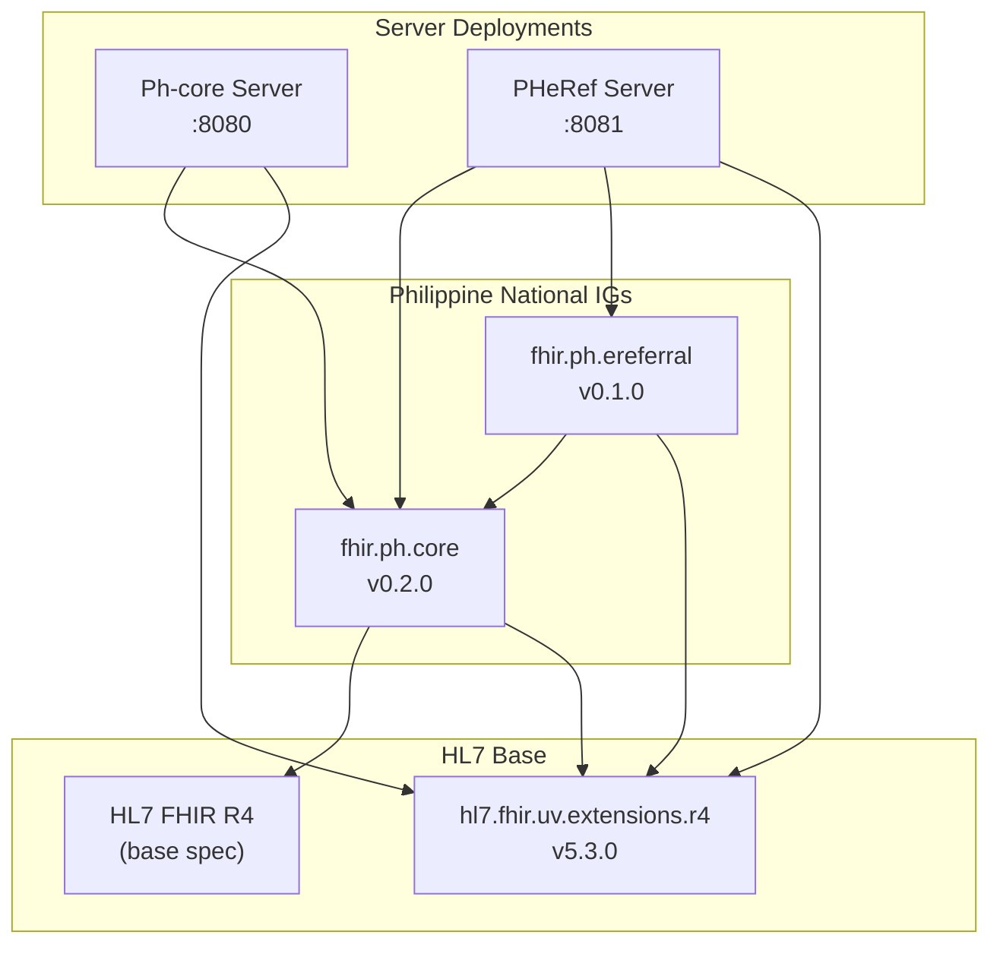
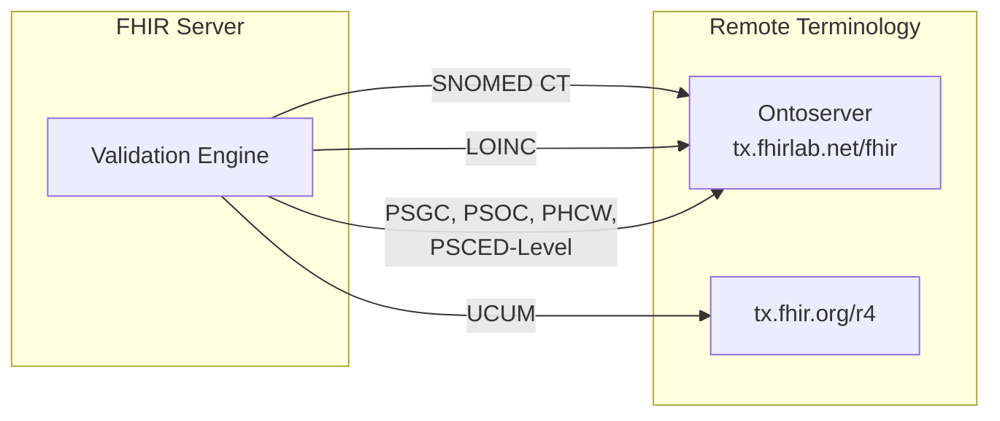
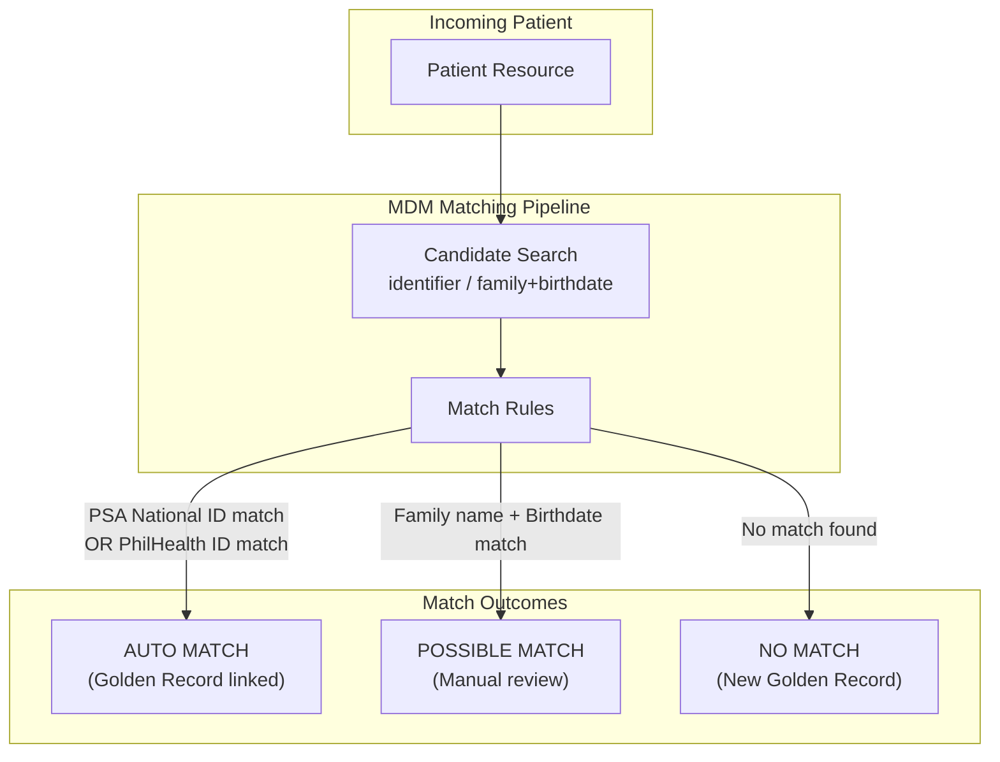
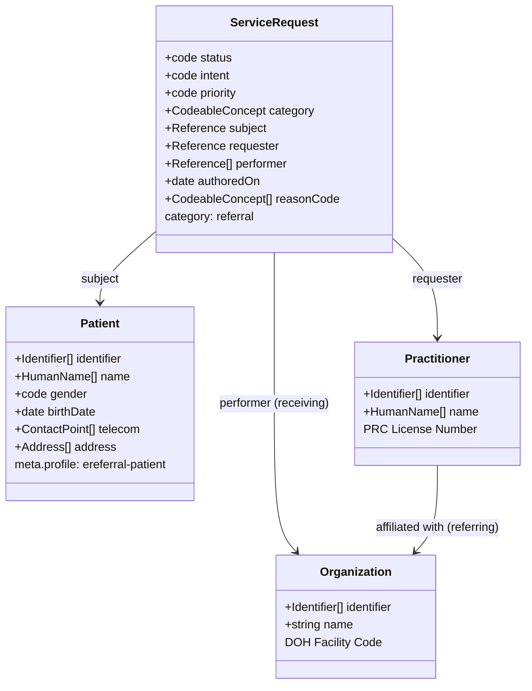
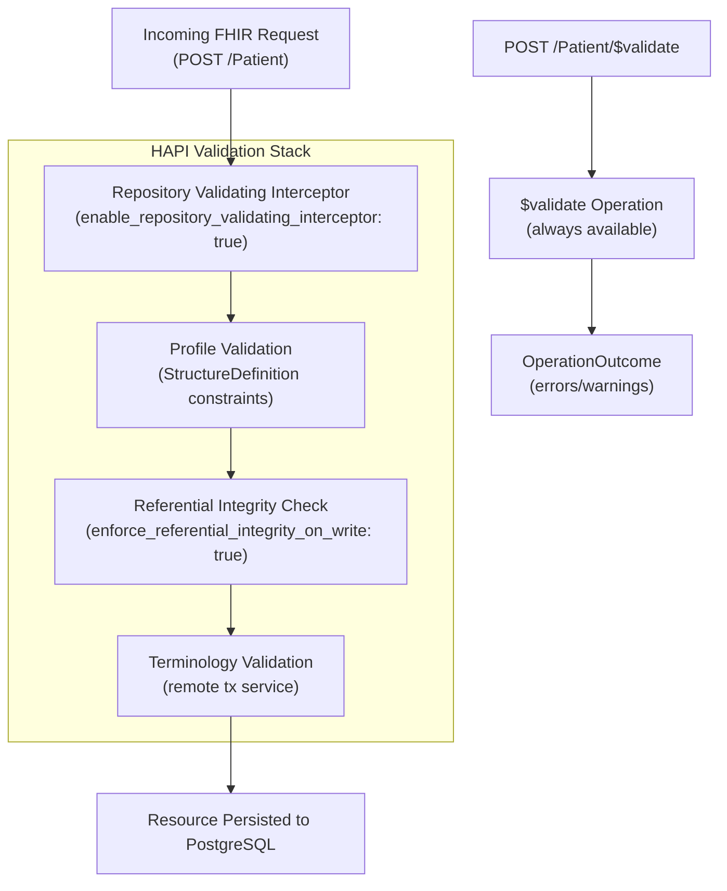
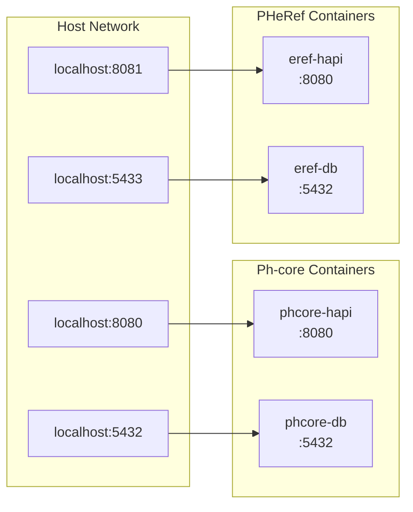
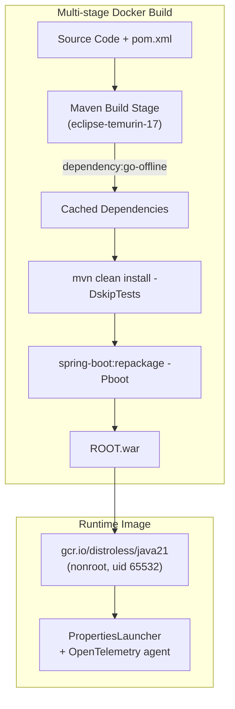
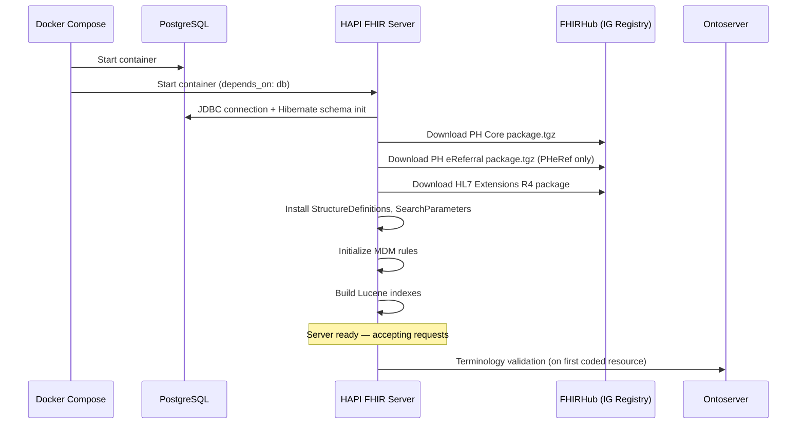

# Architecture Documentation

## System Overview

This repository contains two FHIR R4 server deployments for the Philippine National Telehealth Center (NTHC), both built on [HAPI FHIR JPA Server Starter](https://github.com/hapifhir/hapi-fhir-jpaserver-starter):

- **Ph-core** — Philippine Core FHIR server hosting the PH Core Implementation Guide
- **PHeRef** — Philippine eReferral FHIR server hosting both PH Core and PH eReferral IGs

Each deployment is a self-contained Docker Compose stack with its own PostgreSQL database, Lucene full-text index, and HAPI FHIR JPA application.

## Deployment Architecture



## Container Architecture



## Implementation Guide Dependency



## Terminology Resolution

Both servers delegate terminology validation to external terminology services rather than hosting CodeSystem/ValueSet expansions locally. This keeps the servers lightweight and ensures terminology is always current.



**Terminology routing (PHeRef):**

| System | Route |
|--------|-------|
| SNOMED CT (`https://snomed.info/sct`) | Ontoserver |
| LOINC (`http://loinc.org`) | Ontoserver |
| PSGC (`https://psa.gov.ph/classification/psgc`) | Ontoserver |
| PSOC (`https://fhir.doh.gov.ph/phcore/CodeSystem/PSOC`) | Ontoserver |
| PHCW (`https://fhir.doh.gov.ph/phcore/CodeSystem/PHCW`) | Ontoserver |
| UCUM (`http://unitsofmeasure.org`) | tx.fhir.org |

**Ph-core** uses a wildcard route — all terminology systems go to Ontoserver.

## Master Data Management (MDM)

Both servers run HAPI's MDM module for patient deduplication using Philippine national identifiers.



**MDM matching rules:**

| Field | Identifier System | Algorithm | Result |
|-------|-------------------|-----------|--------|
| PSA National ID | `https://psa.gov.ph/philid` | IDENTIFIER (exact) | MATCH |
| PhilHealth ID | `https://philhealth.gov.ph` | IDENTIFIER (exact) | MATCH |
| Family Name + Birth Date | — | STRING + DATE | POSSIBLE_MATCH |

**EID System:** `https://psa.gov.ph/philid` (Philippine Identification System)

## eReferral Workflow — Resource Model



## Validation Pipeline



## Network Port Mapping



## Repository Structure

```
FHIR-Server/
├── Ph-core/                    # PH Core FHIR server
│   ├── docker-compose.yml      # Stack: phcore-hapi + phcore-db
│   ├── Dockerfile              # Multi-stage build (Maven → distroless)
│   ├── pom.xml                 # HAPI FHIR JPA dependencies
│   ├── config/
│   │   ├── application.yaml    # Server config, IG loading, terminology
│   │   └── mdm-rules.json     # Patient deduplication rules
│   └── src/                    # Java sources and tests
├── PHeRef/                     # PH eReferral FHIR server
│   ├── docker-compose.yml      # Stack: eref-hapi + eref-db
│   ├── .env                    # PHEREF_SERVER_ADDRESS, PHEREF_SERVER_PORT
│   ├── Dockerfile              # Multi-stage build (Maven → distroless)
│   ├── pom.xml                 # HAPI FHIR JPA dependencies
│   ├── config/
│   │   ├── application.yaml    # Server config, IG loading, terminology
│   │   └── mdm-rules.json     # Patient deduplication rules
│   └── src/                    # Java sources and tests
├── tests/
│   └── run-bundle-test.py      # Bundle transaction test script
├── docs/
│   ├── ARCHITECTURE.md         # This document
│   └── TESTING.md              # Test script documentation
├── generate_eref_testing_report.py     # eReferral test suite (Python)
└── generate_eref_testing_report_v2.sh  # eReferral test suite (Bash, legacy)
```

## Key Configuration Differences

| Aspect | Ph-core | PHeRef |
|--------|---------|--------|
| Host port (FHIR) | 8080 | 8081 |
| Host port (PostgreSQL) | 5432 | 5433 |
| Implementation Guides | PH Core, HL7 Extensions R4 | PH Core, PH eReferral, HL7 Extensions R4 |
| Terminology routing | Wildcard → Ontoserver | Per-system routing (Ontoserver + tx.fhir.org) |
| Container name | phcore-hapi | eref-hapi |
| Port configurable via .env | No | Yes (`PHEREF_SERVER_PORT`) |
| IG dependency fetching | `fetchDependencies: true` | Selective (`false` for PH Core, `true` for eRef) |
| Access logging | Disabled | Enabled (structured, `fhirtest.access`) |

## Access Logging

PHeRef has structured per-request access logging enabled via HAPI's `LoggingInterceptor`. Each FHIR request produces a log line with operational metadata suitable for statistical accounting and debugging.


**Logged fields:**

| Field | Description |
|-------|-------------|
| `verb` | HTTP method (GET, POST, PUT, DELETE) |
| `path` | Servlet path (e.g. `/fhir/Patient`) |
| `op` | FHIR operation type (read, search, create, etc.) |
| `opName` | Named operation (e.g. `$validate`) |
| `resource` | Resource type or ID |
| `remoteAddr` | Client IP address |
| `forwardedFor` | X-Forwarded-For header (proxy/load balancer) |
| `userAgent` | Client User-Agent header |
| `requestId` | Unique request identifier |
| `params` | Query/search parameters |
| `processingMs` | Server processing time in milliseconds |

**Error logging** is also enabled — failed requests additionally capture `exceptionMessage`.

**Note:** Ph-core does not currently have the logger enabled. The logger configuration exists in the HAPI starter codebase but is commented out in Ph-core's `application.yaml`.

## Build Pipeline



## Startup Sequence


