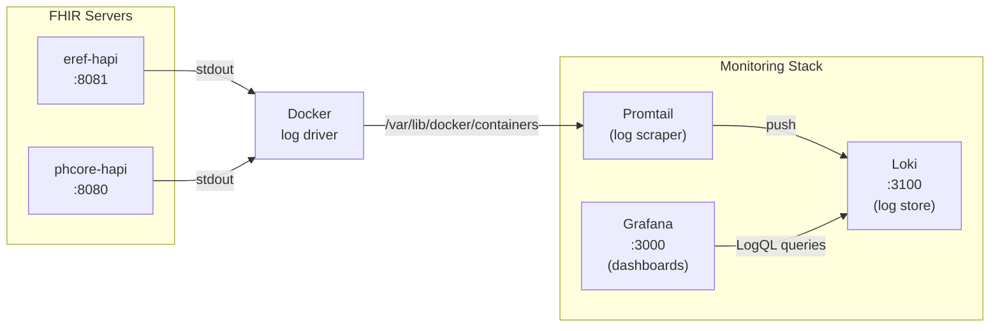

# Monitoring Stack — Grafana + Loki + Promtail

## Overview

This monitoring stack provides real-time dashboards for the FHIR server access logs using:

- **Promtail** — scrapes Docker container logs from `eref-hapi` and `phcore-hapi`
- **Loki** — log aggregation and indexing (stores logs, serves LogQL queries)
- **Grafana** — visualisation dashboards with a pre-provisioned FHIR access log dashboard

The stack runs alongside the FHIR server Docker Compose stacks and requires no changes to the FHIR server configuration. It reads logs directly from the Docker daemon.

## Architecture



## Prerequisites

- Docker and Docker Compose
- The PHeRef stack running with access logging enabled (default on current `main`)
- Promtail needs access to the Docker socket and container log files

## Quick Start

```bash
cd monitoring
docker compose up -d
```

Grafana is available at **http://localhost:3000** (login: `admin` / `admin`).

The pre-provisioned dashboard "FHIR eReferral Access Logs" is available under the "FHIR Server" folder.

## Services

| Service | Port | Purpose |
|---------|------|---------|
| Grafana | 3000 | Dashboard UI |
| Loki | 3100 | Log storage and query engine |
| Promtail | 9080 (internal) | Log collection agent |

## How Log Collection Works

1. The FHIR servers write access logs to stdout via SLF4J.
2. Docker captures stdout and writes it to JSON log files at `/var/lib/docker/containers/<id>/<id>-json.log`.
3. Promtail uses Docker service discovery (`docker_sd_configs`) to find containers named `eref-hapi` or `phcore-hapi`.
4. Promtail tails their log files and pushes log entries to Loki.
5. A pipeline stage parses the `key=value` access log format into structured labels (`verb`, `op`, `resource`) and extracts `processingMs` as a numeric field for quantile queries.

## Log Parsing

Promtail parses the access log format using regex:

```
verb=<verb> path=<path> op=<op> opName=<opName> resource=<resource> remoteAddr=<remoteAddr> forwardedFor=<forwardedFor> userAgent=<userAgent> requestId=<requestId> params=<params> processingMs=<processingMs>
```

Extracted labels available in Grafana:

| Label | Description | Example |
|-------|-------------|---------|
| `verb` | HTTP method | `GET`, `POST` |
| `op` | FHIR operation type | `search-type`, `create`, `read` |
| `resource` | FHIR resource type | `Patient`, `ServiceRequest` |
| `container` | Source container name | `eref-hapi` |

Extracted fields (for `unwrap` numeric queries):

| Field | Description |
|-------|-------------|
| `processingMs` | Server processing time in milliseconds |

## Pre-Built Dashboard Panels

The provisioned dashboard includes:

| Panel | Type | Description |
|-------|------|-------------|
| Request Rate (req/s) | Time series | Requests per second grouped by HTTP verb |
| Request Rate by Resource | Time series | Requests per second grouped by FHIR resource type |
| Response Time (p50/p95/p99) | Time series | Processing time percentiles over 5-minute windows |
| Errors | Time series | Error rate (lines containing `error=`) |
| Top Resources (last 1h) | Pie chart | Request distribution by resource type |
| Operations Breakdown (last 1h) | Pie chart | Request distribution by FHIR operation |
| Recent Access Logs | Log panel | Raw scrollable log stream with filtering |

## Useful LogQL Queries

### All access logs from eRef
```logql
{job="eref-hapi"} |= "verb="
```

### Requests for a specific resource
```logql
{job="eref-hapi", resource="Patient"}
```

### Slow requests (>500ms)
```logql
{job="eref-hapi"} | pattern `verb=<_> path=<_> op=<_> opName=<_> resource=<_> remoteAddr=<_> forwardedFor=<_> userAgent=<_> requestId=<_> params=<_> processingMs=<processingMs>` | unwrap processingMs | processingMs > 500
```

### Error log lines
```logql
{job="eref-hapi"} |= "error="
```

### Request count by operation over last hour
```logql
sum(count_over_time({job="eref-hapi"} | pattern `verb=<_> path=<_> op=<op>` [1h])) by (op)
```

## Customisation

### Adding more containers to monitor

Edit `monitoring/promtail/config.yml` and add container names to the `filters.values` list:

```yaml
filters:
  - name: name
    values:
      - eref-hapi
      - phcore-hapi
      - your-new-container
```

### Changing Grafana credentials

Edit `monitoring/docker-compose.yml` environment variables:

```yaml
GF_SECURITY_ADMIN_USER: your-user
GF_SECURITY_ADMIN_PASSWORD: your-password
```

### Persisting data across restarts

Grafana and Loki data are stored in named Docker volumes (`grafana-data`, `loki-data`). These persist across `docker compose down` / `up` cycles. To fully reset:

```bash
docker compose down -v
```

### Adjusting retention

Loki uses its default retention (no automatic deletion). To add retention, mount a custom Loki config:

```yaml
volumes:
  - ./loki/config.yml:/etc/loki/local-config.yaml:ro
```

With a config that includes:
```yaml
limits_config:
  retention_period: 168h  # 7 days
compactor:
  retention_enabled: true
```

## Stopping the Stack

```bash
cd monitoring
docker compose down
```

Add `-v` to also remove stored log data and Grafana state.

## Troubleshooting

### No logs appearing in Grafana

1. Check Promtail can see the containers:
   ```bash
   docker logs promtail 2>&1 | grep "eref-hapi"
   ```

2. Verify the FHIR server is producing access logs:
   ```bash
   docker logs eref-hapi 2>&1 | grep "verb="
   ```

3. Check Loki is receiving data:
   ```bash
   curl -s http://localhost:3100/loki/api/v1/labels | jq .
   ```

### Promtail permission denied

Promtail needs read access to Docker's socket and container log directory. Ensure the volumes are mounted correctly and the user running Docker has appropriate permissions.

### Dashboard shows "No data"

The dashboard filters on `job="eref-hapi"`. If your container has a different name, update the dashboard queries or the Promtail relabel config.
